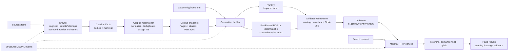

# Scout

Scout is a single-node Rust search service for explicitly allowlisted technical documentation.
It crawls Sources, publishes immutable Corpus snapshots, builds validated keyword and semantic
Index Generations, then serves Page-level results with Passage evidence.

```text
sources.toml
  crawl + robots.txt/sitemap discovery + bounded retries
  -> immutable Corpus snapshot: Pages, aliases, Passages
data/config/index.toml
  -> Index Generation: Tantivy keyword index + USearch vector index
  -> atomic activation through CURRENT
  -> HTTP search
```

## Technical implementation



Implementation is deliberately dependency-light and single-process:

- `src/crawl.rs` uses blocking `reqwest` with a coordinator for global/origin concurrency,
  politeness spacing, retries, robots policy, sitemap discovery, redirect bounds, and safety caps.
- `src/extract.rs` uses `scraper` to select useful document content, preserve headings and code,
  normalize text, and compute extracted-content hashes.
- `src/corpus.rs` materializes immutable Pages, exact-content aliases, and heading-bounded Passages;
  IDs and artifact ordering are deterministic. Repeated final URLs use a recorded lexical capture
  selection key, so conflicting responses are explainable without arrival-order dependence.
- `src/generation.rs` builds Tantivy keyword fields plus a USearch cosine index. `fastembed` provides
  BGE-small embeddings; deterministic embeddings exist only for tests. Manifests, catalogs, counts,
  identities, and SHA-256 checksums are reopened and fully validated before build success or activation.
- `src/search.rs` loads one valid Generation per request, retrieves keyword and semantic candidates,
  fuses them with reciprocal rank fusion, then aggregates Passage hits to representative Pages.
- `src/http.rs` exposes the JSON API through `TcpListener` and a small HTTP/1.1 implementation;
  `src/observability.rs` writes structured operational events and optional NCSA access logs.
- `src/evaluation.rs` and `src/benchmark.rs` enforce frozen inputs, relevance metrics, paired
  bootstrap diagnostics, replayable staging runs, latency distributions, and integrity evidence.

## Quick start

Requires Rust/Cargo. Crawling needs network access. The `fastembed` backend downloads and caches
`BAAI/bge-small-en-v1.5`; use the deterministic backend only for fixtures and contract tests.

```bash
cargo build --release
BIN=target/release/scout
DATA=data

$BIN crawl --config sources.toml --data-dir "$DATA"
# Copy snapshot_id from the crawl output into data/config/index.toml.
$BIN index build --corpus <snapshot-id> --data-dir "$DATA"
$BIN index activate --generation <generation-id> --data-dir "$DATA"
$BIN serve --data-dir "$DATA" --bind 127.0.0.1:8080
```

`data/config/index.toml` is mandatory and intentionally explicit. It pins the Corpus snapshot,
extraction and Passage schemas, Tantivy boosts, model provenance, embedding backend, USearch
parameters, and reciprocal-rank-fusion settings. No default profile is generated.

Minimal `sources.toml`:

```toml
schema_version = "scout.sources.v1"
contact_url = "https://example.com/contact"
user_agent = "Scout/0.1 (+https://example.com/contact)"
page_target = 1000

[[sources]]
source_id = "rust"
seeds = ["https://doc.rust-lang.org/book/"]
allowed_origins = ["https://doc.rust-lang.org"]
path_prefixes = ["/book/"]
```

Each Source needs seeds, allowed Origins, and absolute path boundaries. The crawler normalizes
URLs, obeys robots policy, follows same-allowlist redirects, discovers same-Origin sitemaps,
limits frontier/request/body/time budgets, and records structured JSONL events.

## CLI

```text
scout crawl --config <sources.toml> --data-dir <dir> [--json]
scout index build --corpus <snapshot-id> --data-dir <dir> [--json]
scout index activate --generation <generation-id> --data-dir <dir> [--json]
scout index recover --data-dir <dir> [--json]
scout index verify --data-dir <dir>
scout index prune --data-dir <dir> [--retain <generation-id>]... [--json]
scout serve --data-dir <dir> --bind <address> [--access-log <path>]
scout evaluate --package <dir> --data-dir <dir>
scout benchmark --config <benchmark.toml> --data-dir <dir>
```

`index build` writes a validated Generation under staging. `index activate` seals it, verifies
checksums/counts/identity, and atomically updates `CURRENT`; the previous valid Generation is
kept through `PREVIOUS`. `recover`, `verify`, and `prune` manage that lifecycle.

## HTTP API

```bash
curl http://127.0.0.1:8080/v1/healthz
curl http://127.0.0.1:8080/v1/readyz
curl http://127.0.0.1:8080/v1/generation

curl -X POST http://127.0.0.1:8080/v1/search \
  -H 'content-type: application/json' \
  -d '{"query":"ownership and borrowing","mode":"hybrid","limit":10}'
```

Search modes: `keyword`, `semantic`, `hybrid` (default). Optional `source` filters by Source.
Responses include active Generation and Corpus snapshot IDs. Results are grouped by Page and
include the winning Passage ID, heading path, URL, score, title, and bounded snippet.

Routes:

- `GET /v1/healthz` — process health.
- `GET /v1/readyz` — readiness backed by a valid active or recovered Generation.
- `GET /v1/generation` — active Generation metadata and artifact counts.
- `POST /v1/search` — Page-level retrieval.

## Evaluation and benchmarks

Evaluation packages contain `metadata.json`, `queries.jsonl`, and `judgments.jsonl`, with optional
rankings. The evaluator enforces the frozen 64-query package, Page-level 0–3 judgments, and
reports nDCG@10, MRR@10, Recall@100, split diagnostics, and paired-bootstrap intervals.

Benchmark runs lock Corpus, Generation, build/model, evaluation, and Reference-profile provenance.
They can replay frozen local Crawl payloads, measure crawl/index/search phases, and write integrity,
latency, resource, and operational evidence under `data/benchmarks/<run-id>/`. Resource evidence is
independently sampled from `/proc`/`df` and retained as `resource-config.json`, timestamped
`resource-samples.jsonl`, `resource-boundaries.jsonl`, and a reproducible `resource-summary.json`;
set `resource_sampling_interval_ms` (default `100`) in the benchmark config when needed. Pilot
Smoke runs check correctness and harness behavior; MVP performance targets come from the real MVP baseline.

## Data layout

```text
data/
  crawls/<run-id>/
  corpora/<snapshot-id>/
  config/index.toml
  generations/.staging/<run-id>/
  generations/<generation-id>/
  CURRENT
  PREVIOUS
  models/
  logs/<run-id>.jsonl
  evaluations/<run-id>/
  benchmarks/<run-id>/
    resource-config.json
    resource-samples.jsonl
    resource-boundaries.jsonl
    resource-summary.json
```

## Development

```bash
cargo test --offline
```

The HTTP server is intentionally minimal: no TLS, authentication, rate limiting, or multi-node
coordination. Bind it to a trusted interface or place it behind an appropriate edge proxy.
